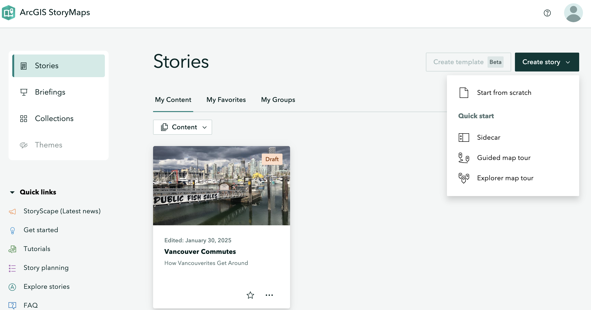
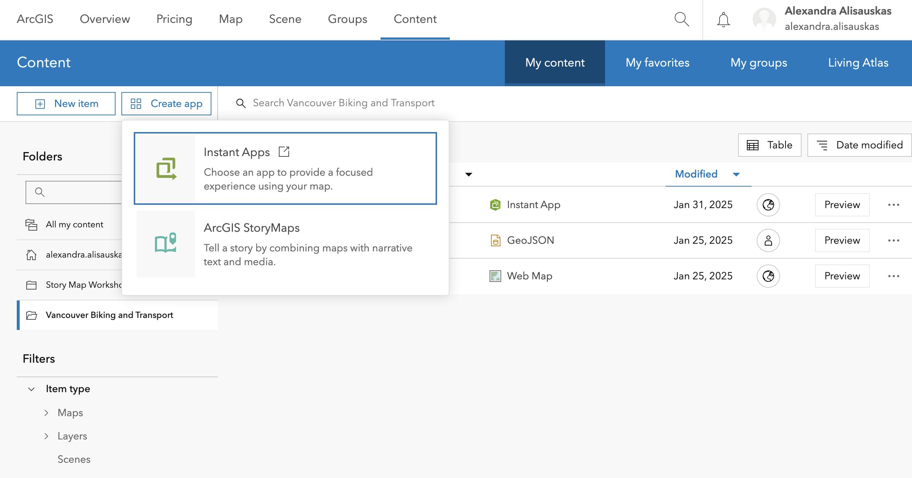

## ArcGIS Online Storymap

To start a Storymap from scratch, go to [Story Maps](https://storymaps.arcgis.com/stories) and click on New Story.

Or from the top left of your [ArcGIS Online homepage](https://www.arcgis.com/), select **Content** on the top banner. Click on the **Create app** and select **ArcGIS Storymaps**.

You can start from scratch and build your own, but they also provide StoryMap templates that begin your StoryMap with a Sidecar, Guided Map Tour or Explorer Map Tour.

The Storymap Content blocks and features will we cover include:
- Configure themes and cover
- Add basic features
    - Add title, subtitle, and Text
    - Add a Separator
- Embed media
    - Add an image or video
- Embed immersive content and media (further instructions on this site)
    - Sidecar
    - Map Tour
    - Swipe
    - Map
- Preview the Storymap
- Publish and share the story map
  
[Check out the example Storymap](https://storymaps.arcgis.com/stories/9d2a3452e2a141399ae6226a627b4a36)
