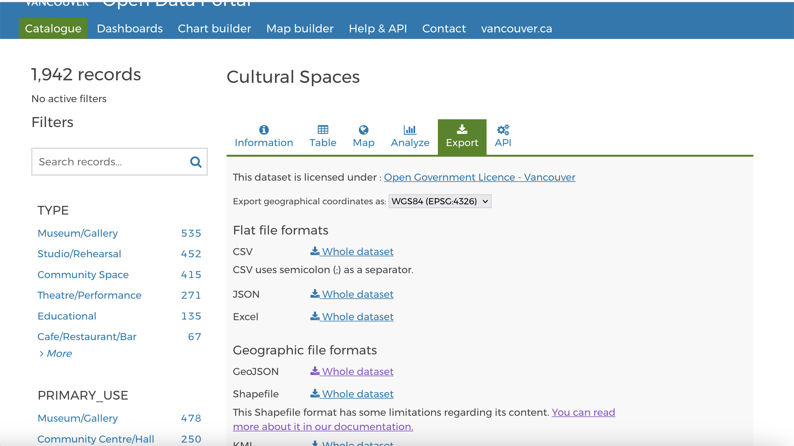
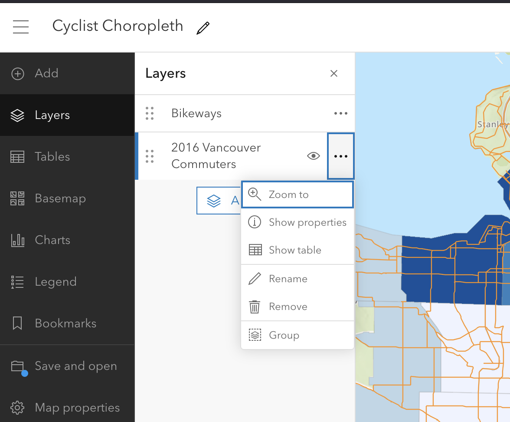

## Find Data to add to your map on Vancouver Open Data Portal

[The Vancouver Open Data Portal](https://opendata.vancouver.ca/pages/home/) is an excellent source for a variety of municipal data, including geographic data layers such as point, lines, polygons, and raster images. 

As long as the data you are looking at has a geographic element, you can download it as a GeoJSON to add as a layer to your ArcGIS Online webmap. Use the export tab to download.

## Add Data from File

On the sidebar on the left, click on **Layers**, then on click on the drop down arrow next to **Add layer** to add a layer from a file.

Ensure you export any files from your GIS or download any files you find as GeoJSON.

## Add Data from the Living Atlas

You can also add data from the [Living Atlas](https://livingatlas.arcgis.com/en/), a large collection of geographic information compiled and created by [Esri.](https://www.esri.com/en-us/home)

Click on **Layers**, then click on the **Add** button.

From the dropdown arrow next to My Content, select Living Atlas and you can search for layers to add.

*Note: If you only have a public ArcGIS account, you will have access to fewer layers in the Living Atlas.*

## Displaying Layers

You can add as many layers as you want and they will display simultaneously.

Next to the layer name, you will see an eye and three dots. Click on the eye to make the layer visible or invisible. 

If you click on the three dots next to the layer name, you have the following options:
- Zoom to layer: Will zoom your map to the layer location
- Show properties: Displays things like symbology
- Attribute table: Shows the data in a tabular format
- Rename and Remove

Layer order matters. The higher a layer is in the panel, the higher (hence, more visible) it’ll be in the map view. If you want to represent points or lines over polygons, for instance, make sure those elements are higher. You can move layers by clicking on the 6 dots to the left of the layer name and dragging.
