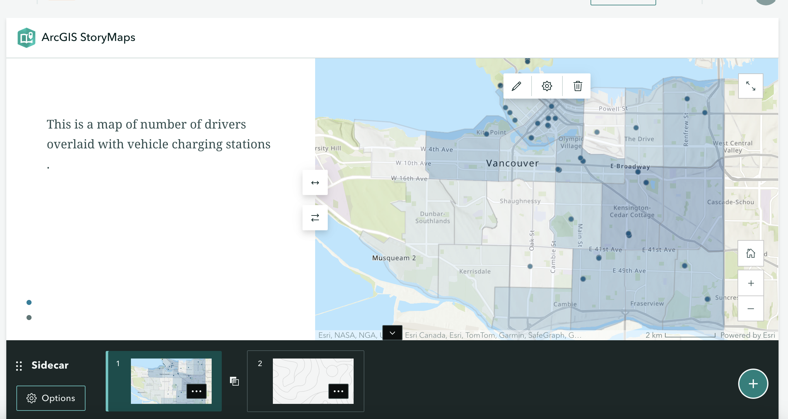
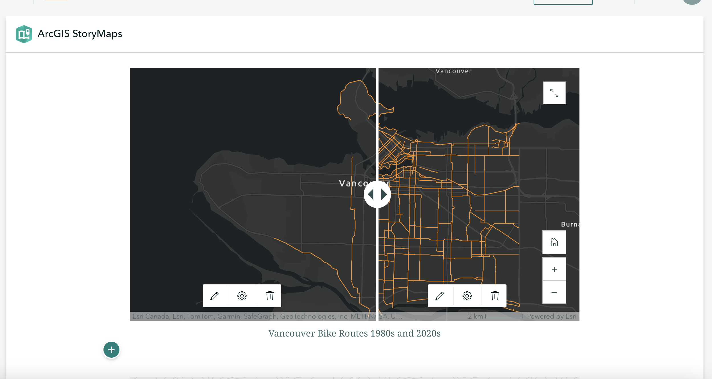
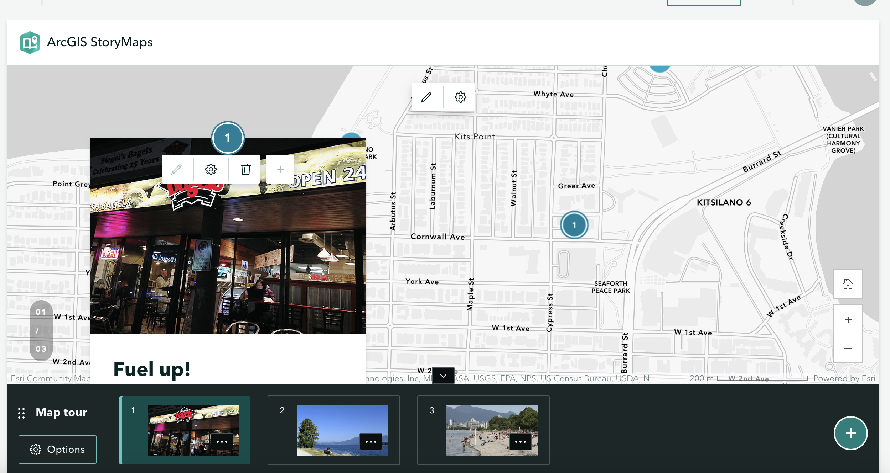

## Embed immersive content and media to the Story Map

### Sidecar
You can combine text and image through immersive scrolling with **sidecar**. There are three layouts of sidecar, **Docked**, **Floating** and **Slideshow**.

Add your text, and select a visual to add - this could be a colour, image, map, or slide.

### Embed a map
You can embed a **webmap** that you've created on ArcGIS Online in your StoryMap. You can also create and include an **express map** where you can draw features on a basemap.

### Swipe
You can use the Swipe to let readers easily compare two maps (webmap or express) or images with an interactive slider. This is great to show changes over time. 

{: .note}
Each map on the swipe is a separate webmap. You will have to create a separate webmap highlighting the features you want to include. For instance, you will have to create a map for 1980s bike routes and one for 2000s bikeroutes. You can easily do this with the filter option on webmaps.

Also note that there is a size limit to images you can upload on the public account. For raster images, you may need to resize them.

### Map tour
You can create a **map tour** to showcase a set of places your readers can explore in any order, or be led through one at a time.

There are two options of zoom level that you can select when you add a location. **Use map tour setting** will automatically adjust the zoom level so all points are visible simultaneously. **Use current zoom level** will keep the zoom level always be street or city.

{: .note}
Select the pencil icon on the map to adjust the map appearance, such as zoom level, basemap, point color and map type (2D or 3D).

