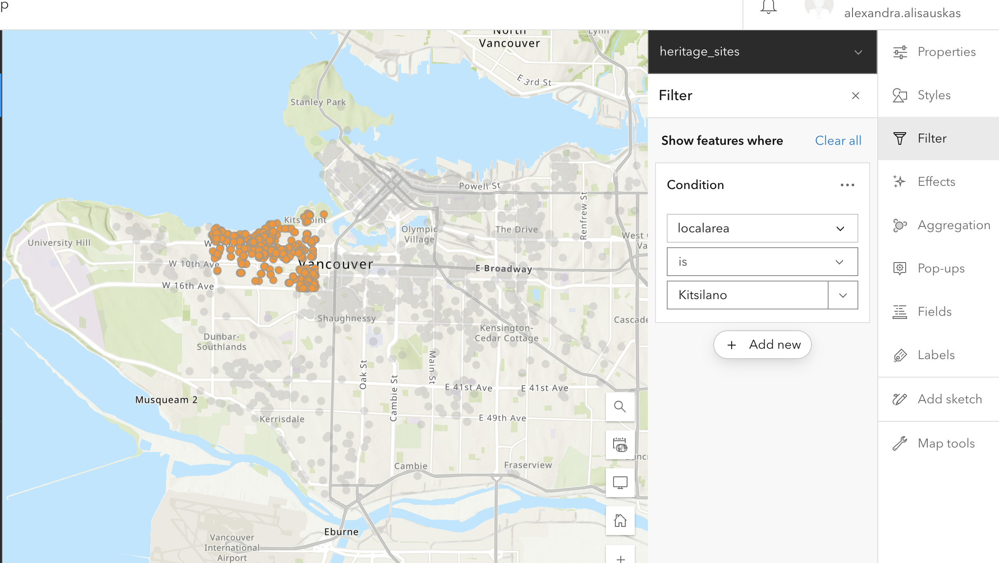
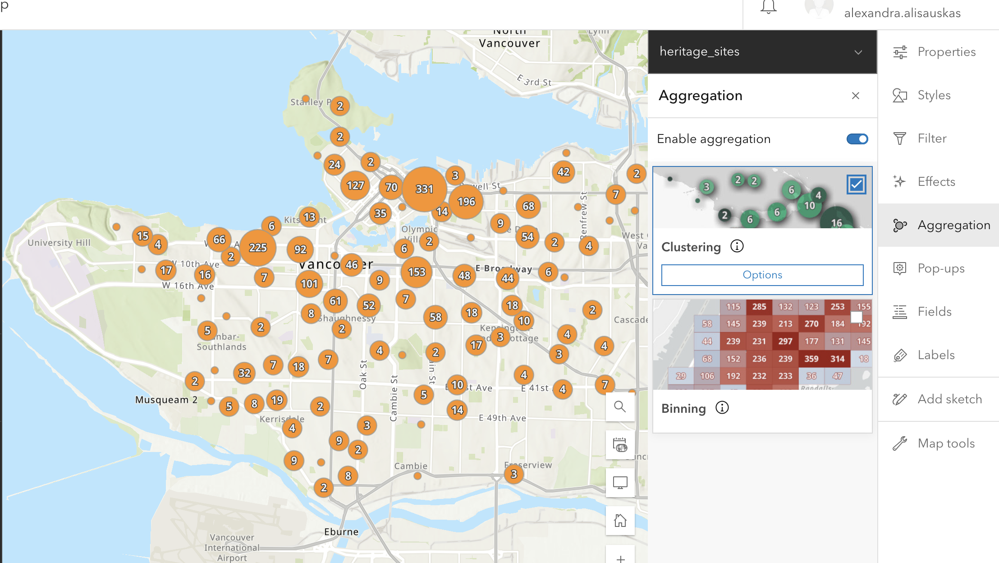
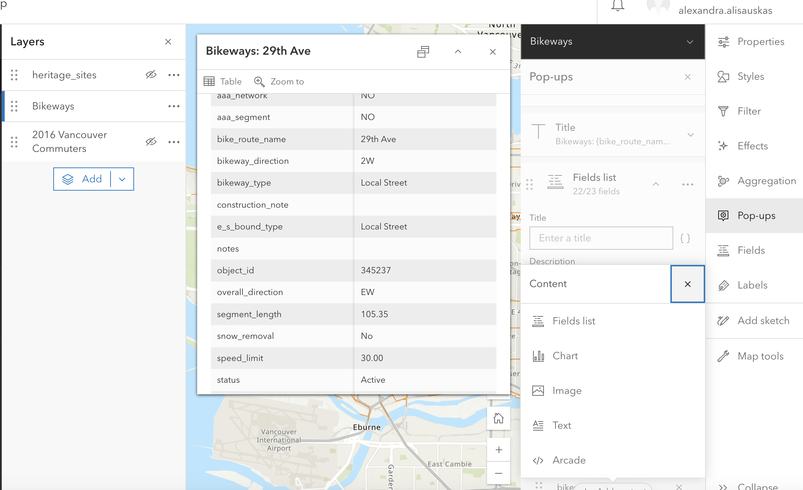
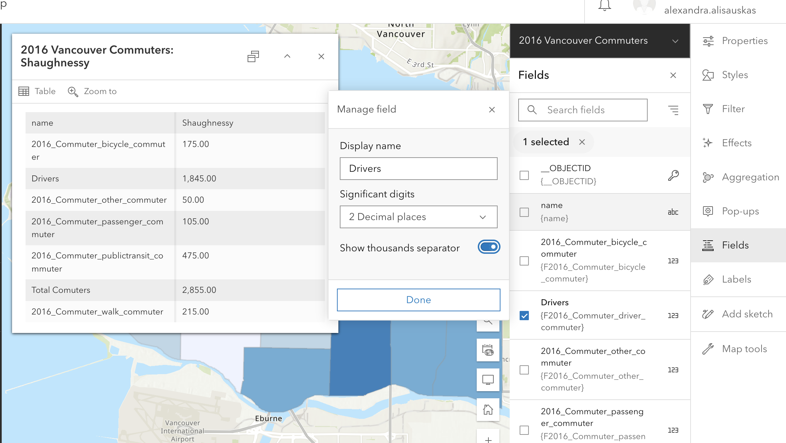
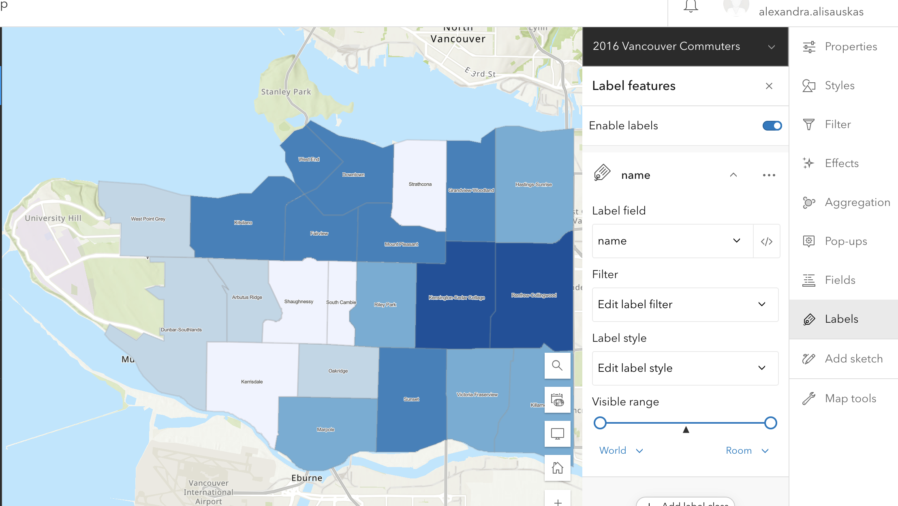

# Visualize Your Layer Data

## Sample Data

You can download the data below and add each file as a layer to your ArcGIS Online webmap to play around with features.

**Vancouver_Commuter_2016.geojson** is a polygon layer with commuter data joined to local area boundaries.

**bikeways.geojson** is a line layer showing Vancouver bike paths

**heritage-sites.geojson** is a point layer showing Vancouver heritage sites.

[Download Data](./StorymapsWorkshopData.zip){: .btn .btn-blue }

## Styles
The Style tools available to you will depend on the features in your layer.

### Counts and Amounts
Read more about [Data Classification Methods](https://pro.arcgis.com/en/pro-app/latest/help/mapping/layer-properties/data-classification-methods.htm) and how you might want to use them.

### Filtering for certain elements
Use the filter feature to create a condition and determine what shows up on your map. This feature is useful if you have data that varies in type/category or date. you can also filter to only include features in a certain neighbourhood.

If you want to create a Swipe on your Storymap, the Filter function can be very useful to single out data and create the individual maps that make up the Swipe. Once you've filtered the data you want to show, make sure to "Save as" your map. In the example below I have filtered heritage sites in the local area of Kitsilano.

To Try
{: .label .label-green }
- On the heritage_sites layer, try filtering to include only archeological sites
- On the Bikeways layer, try filtering to include only bikeways created in the 1990s

### Aggregation

You can enable aggregation on your map. 

**Binning** aggregates data to predefined cells, representing point, line, or polygon data as a gridded polygon layer. The bins show point, line, or polygon density in geographic space instead of screen space.

**Clustering** aggregate points into clusters and display them as one symbol. Clusters use proportionally sized symbols and change dynamically with the map scale. Clustering only works for point features.

Spatial aggregation is one method for visualizing high-density data. Read more about [best practices for visualizing high-density data](https://doc.arcgis.com/en/arcgis-online/reference/best-practices-high-density-data.htm)

### Pop Ups
Pop-ups can bring focus to the attributes associated with each layer in the map, such as hiking trails, land use types, or unemployment rates. They can contain attachments, images, charts, and text, and they can link to external web pages. 

The Pop Ups tool lets you configure which attributes are displayed and how. You can edit how your pop up s titled, and determine which fields to include. You can also add content, like images, charts, or text.

### Fields
The fields feature lets you edit field elements for your geographic attributes. In the free account, you can rename fields, and select decimal points. 

### Labels
The Label feature lets you add labels for various elements on your map. Click enable, then select which field you want to serve as a label. In the examplbe below, the neighbourhood name field is being used as a label.

### Add Sketch
You can add add points, or draw lines, shapes, etc. with the Add Sketch function. This can be useful to highlight map features manually. Any sketch elements you add will create a new layer with those elements.

#### More Resources
- For more in-depth instructions and examples, visit our workshop [Visualizing Data in ArcGIS ONline](https://ubc-library-rc.github.io/intro-AGOL/)
